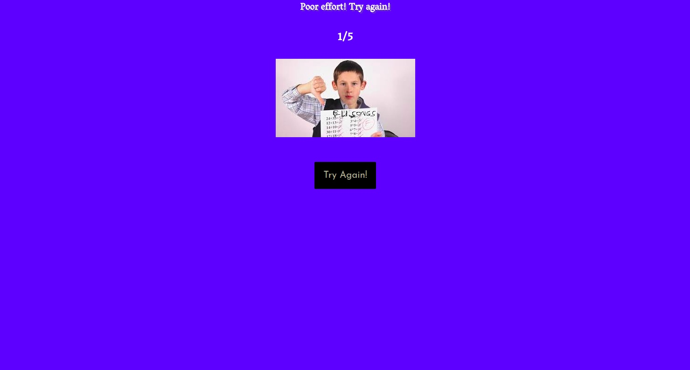

  

I decided to make this the day before the Eurovision Finals. I spent a great deal of that time trying to find good sources of data about the songs. In order for this to be complete i would need to track down the details for every song; the artist, song title, lyrics and image of the act. I taught myself some rudimentary web scraping techniques, npm installed Cheerio and Require and got to work. It was a fun project working out how to automate collecting all the data.  

  

Then i put together the React app itself. On initial load it comes to an intro page. When you click to start the game i switch out the intro page for the 'GamePlay.js' component. This component starts on question and when an answer is given it flips over to answer mode.  

  

The position in the quiz and the score are kept on display in the GamePlay component. When all the rounds are complete it shows your score and asks if you want to play again, and the button just resets the game state to zero and shows the intro page.

