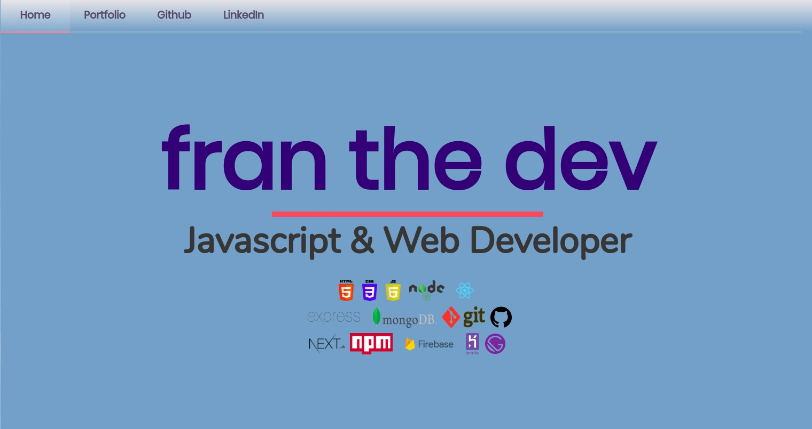
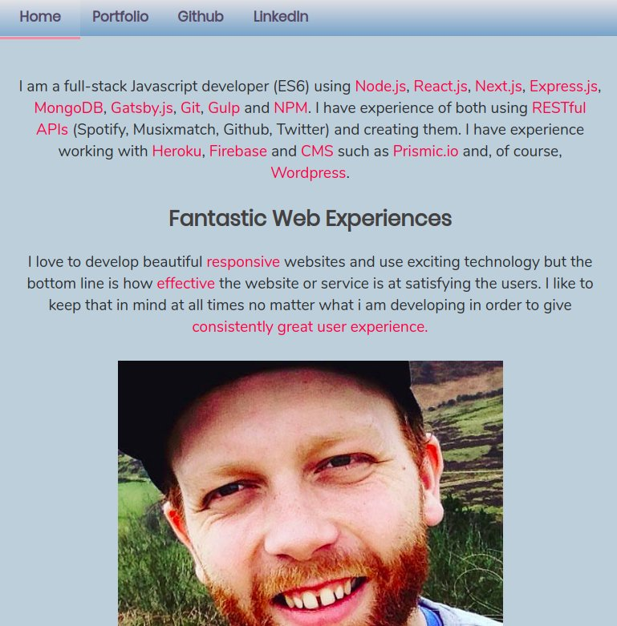
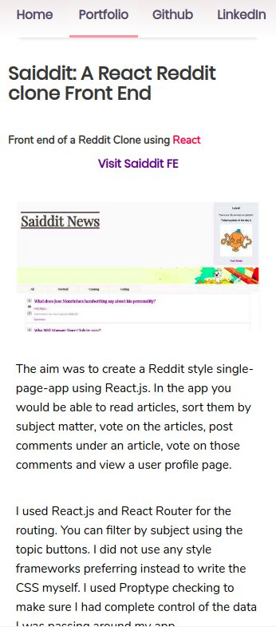
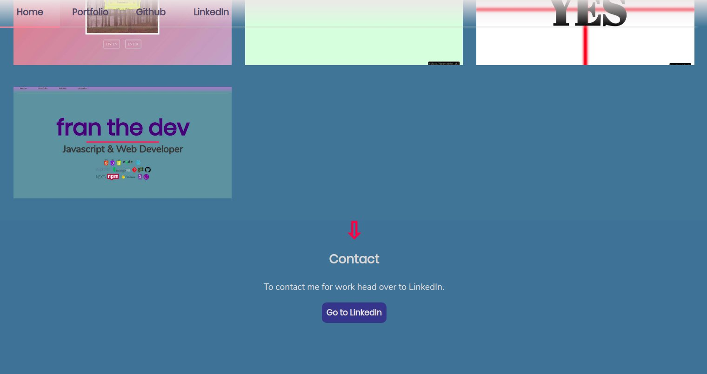

Embracing the JAMstack workflow i remade my homepage using Gatsby.js. I wanted to move away from the basic HTML, CSS, and JS website i had in version 1.0. I wanted to be able to add a new item to the portfolio quicker. I explored various JAMstack setups before settling on Gatsby.js.

I was able to draw upon my knowledge of React. Using a component based framework like React allows development in Gatsby to be quick and embracing of modularity. It also allows the website to be fast for the user. The build process creates a static site that can be hosted anywhere but still providing the dynamic, single-page-app advantages of React.

As you can see when you compare to the previous version the design has been improved markedly for 2.0. 

