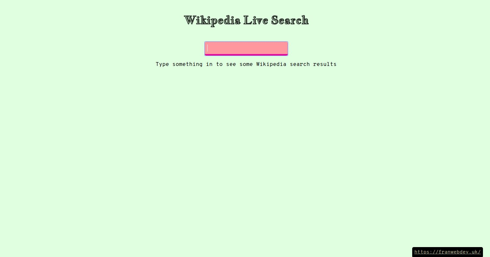

  

A quick project that allows the user to search Wikipedia for topics of their choosing.  

  

A simple implementation of many of the essential ingredients of a React practice project with inputs and data fetching.  

  